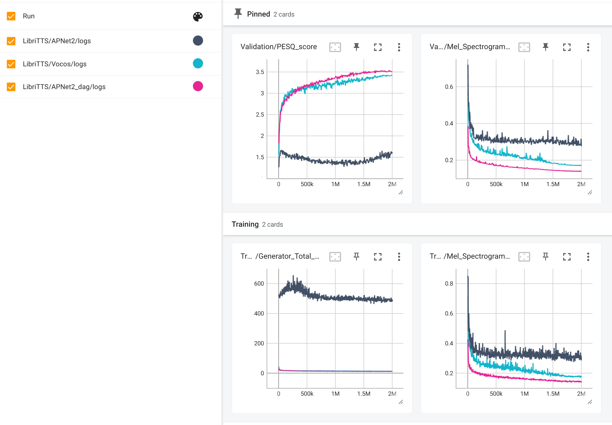

# Mag_Pha_Tensorboard

We provide the training logs for better illustruation of the performance collapse in APNet2 on the LibriTTS dataset.  \
APNet2_dag denotes APNet2 $\dag$.

We will later upload the raw log files. 

